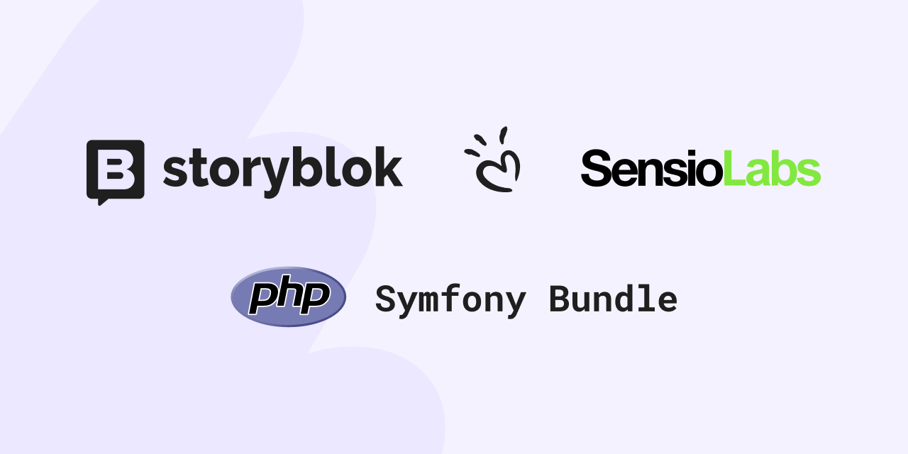

<div align="center">
    
    <h1 align="center">Storyblok PHP Tiptap Extension</h1>
    <p align="center">Co-created with <a href="https://sensiolabs.com/">SensioLabs</a>, the creators of Symfony.</p>
</div>

This library provides **Tiptap extensions** for [Storyblok’s](https://www.storyblok.com/) **RichText field**, enabling seamless integration with the [Tiptap for PHP](https://github.com/ueberdosis/tiptap-php) library.

| Branch | PHP | Code Coverage |
|--------|-----|--------------|
| `main` | [](https://github.com/storyblok/tiptap-bundle/actions/workflows/php.yml) | [](https://codecov.io/gh/storyblok/tiptap-bundle) |


## Installation

Ensure **Composer** is installed globally. If not, follow the [Composer installation guide](https://getcomposer.org/doc/00-intro.md).

### Install via Composer

Run the following command in your project directory to install the latest stable version:

```bash
composer require storyblok/php-tiptap-extension
```

## Usage

This package provides a **Storyblok extension** for **Tiptap for PHP**.

### Basic Example

You need to create an `Editor` instance and add the **Storyblok extension**:

```php
use Tiptap\Editor;
use Storyblok\Tiptap\Extension\Storyblok;

$editor = new Editor([
    'extensions' => [
        new Storyblok(),
    ],
]);

$editor->setContent($text->toArray());

echo $editor->getHTML();
```

## Custom Block Rendering

You can customize how **Storyblok blocks** are rendered using the `blokOptions` configuration.

### Example: Rendering a Custom Heading Block

```php
use Tiptap\Editor;
use Storyblok\Tiptap\Extension\Storyblok;

$editor = new Editor([
    'extensions' => [
        new Storyblok([
            'blokOptions' => [
                'renderer' => function(array $value): string {
                    if ($value['component'] === 'custom_block_heading') {
                        return '<h1 class="red">' . htmlspecialchars($value['text']) . '</h1>';
                    }

                    return '';
                },
            ]
        ]),
    ],
]);

$editor->setContent($text->toArray());

echo $editor->getHTML();
```

## Disabling Specific Extensions

You can disable specific **Tiptap extensions** within Storyblok.

### Example: Disabling `codeBlock` and `heading`

```php
use Tiptap\Editor;
use Storyblok\Tiptap\Extension\Storyblok;

$editor = new Editor([
    'extensions' => [
        new Storyblok([
            'extensions' => [
                'codeBlock' => false,
                'heading' => false,
            ]
        ]),
    ],
]);

$editor->setContent($text->toArray());

echo $editor->getHTML();
```

For a complete list of enabled extensions by default, check out [`Storyblok\Tiptap\Extension\Storyblok`](src/Extension/Storyblok.php).

## License

This library is licensed under the **MIT License**. See the full license in the [LICENSE](LICENSE) file.

## Acknowledgments

This library is built upon the **[Tiptap](https://tiptap.dev/) editor** and the official **[Tiptap for PHP](https://github.com/ueberdosis/tiptap-php/)** library.

Special thanks to **[SensioLabs](https://sensiolabs.com/)** for assisting with the initial implementation of the bundle.

### Additional Resources
- [Storyblok Documentation](https://www.storyblok.com/docs)
- [Tiptap Documentation](https://tiptap.dev/)
- [Tiptap for PHP](https://github.com/ueberdosis/tiptap-php)
